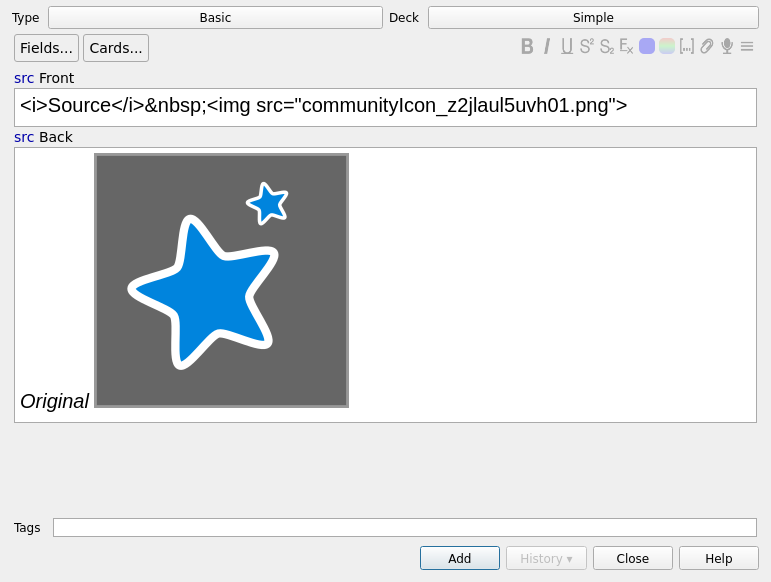

# HTML source in editor
## Rationale
Sometime, it's easier to see the html code of the field instead of the
field rendered. This adds a button allowing to do this change.

## Warning
It may be incompatible with other add-on altering the editor. In
particular with "[Show LaTeX's result in editor/browser](https://ankiweb.net/shared/info/882784122)".

## Usage:
Click on "<src>" above a field to see it's source. Click on "field"
afterward to have the normal view back.

## Configuration:
You can decide to remember which fields should show source, and show
sources of the same field in other notes.

## Links, licence and credits

Key         |Value
------------|-------------------------------------------------------------------
Copyright   | Arthur Milchior <arthur@milchior.fr>
Based on    | Anki code by Damien Elmes <anki@ichi2.net>
License     | GNU AGPL, version 3 or later; http://www.gnu.org/licenses/agpl.html
Source in   | https://github.com/Arthur-Milchior/anki-html-src-in-field
Addon number| [1574324795](https://ankiweb.net/shared/info/1574324795)
Support me on|  or 
